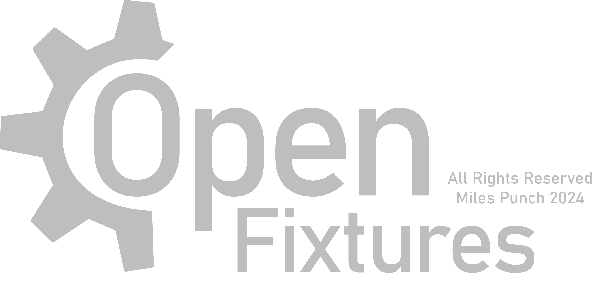

## Statement of Intent
This project is an Arduino based lighting fixture system that provides an easy and achievable to make a lighting fixture from scratch. This will be simple to use, and will be able to make complex fixtures, such as Dimmer channels, Relay channels, and later down the track, color and position controls. This will be great for the experimentalist lighting designer with a great idea for a custom fixture Martin won't make, or a cool DMX controlled thingamabob that Ayrton don't have planned yet.

### Roadmap and Objectives
**Note that this roadmap is non-linear and some tasks may appear completed before others. This may happen in part due to some things being in beta before being adopted, or because I can't be stuffed to do the next thing.**
1. Color control in many modes, such as CMY, RGB, and integration to LED strip protocols such as WS2812B or NeoPixel. *[UPDATE: Color is supported in RGB mode, as well as pixel/non-pixel WS2812B & NeoPixel]*
2. Movement controls with Pan and/or Tilt. This would theoretically be accompanied by Fine/Coarse modes for both channels, as this is a staple of lighting fixtures. *[UPDATE: Servo motors are implemented in a non-tested, purely beta method. Steppers coming soon.]*
3. Custom fixture maker tool that is able to export both OpenFixtures code, and .GDTF files, meaning the LD can rest easy integrating custom lights onto robust, existing controllers, such as MA, Eos, Onyx, and ChamSys. This support will not be extended to all controllers, but where applicable, I will definitely attempt to make sure these formats such as .GDTF will be useful. *[UPDATE: Python based code generator now exists: GTDF and other not yet, however they'll be here when I can get around to them.]*
4. WDMX support for generic WDMX receivers, such as WDMXTRXII boards from Event Lighting *[UPDATE: Not yet. Can't figure it out...]*
5. PCB Support with a custom OpenFixtures PCB. This would theoretically be many different models of fixtures that feature a FET-driver for 12V controls, a Servo driver, and maybe an RGB LED Controller. These would be the products associated with the project intended for a custom lighting fixture that can be reliable as well as repairable, customisable, and affordable. *[UPDATE: Version 1 of the PCB is in design and does exist in beta. First prototypes available soon.]*

## Installation
**This guide is for Windows interations of the Arduino IDE, and may not bear any resemblence to the Mac OS or Linux system installation steps. I'm not a Mac person, and I have no intention to give any money to Apple; thus I am unable to properly check whether this runs properly on Mac OS. As for Linux, you nerds are probably smart enough to figure this shit out for yourselves.**

1. Download and install the Arduino IDE (https://www.arduino.cc/en/software)
2. Select a supported microcontroller (AVE, etc)
3. To install the library, download the latest build, and select it for installation:
- Sketch > Include Library > Add .ZIP library > *Select downloaded ZIP file*
4. Wait for installation to run.
5. To use a pre-made example fixture setup file, access the Examples with:
- File > Examples > OpenFixtures > *example to load*
6. Use Ctrl-U to upload to the board. Note that in most cases, the RS485 $\rightarrow$ Arduino connection must be removed while uploading to ensure the comms bus works properly. This can be avoided by using the Arduino Leonardo which has the seperate USB buses.


## Examples
### Dimmer Channels
```
#include <OpenFixtures.h>   // Import my library
Dimmer dimmer1(1, 6);   // Address 1 and pin 6

void setup() {
DMXSerial.init(DMXReceiver);   // This bit is kinda magic and if you ignore it, everything works fine!
dimmer1.begin();   // Initialize the dimmer object.
}

void loop() {
dimmer1.refresh();
}
```

This code creates a single Dimmer Object called dimmer1 that takes the DMX address from address 1, and forwards the value onto Digital Pin 6. This is now a simple and straight-forward process for the maker.
### Relay Channels
```
#include <OpenFixtures.h>   // Import my library
Relay relay1(1, 6, 128, false);   // Address 1, pin 6, trigger threshold 128/256, turn ON at threshold

void setup() {
  // put your setup code here, to run once:
DMXSerial.init(DMXReceiver);
relay1.begin();
}

void loop() {
  // put your main code here, to run repeatedly:
relay1.refresh();
}

```

This code creates a single Relay Object called relay1 that takes the DMX address from address 1, and forwards the value onto Digital Pin 6, provided that it's value is above or equal to 128/256, keeping in mind that the **inverted** flag is false; if it were true; this logic would be inverted. This is now a simple and straight-forward process for the maker. This doesn't have to be a relay, rather it can be any binary input device, such as an object you want to turn on instantly, such as motor with no speed control other than on/off.

### RGB
```
#include <OpenFixtures.h>   // Import my library
RGB rgb1(1, 6, 7, 8);   // Address 1, pin 6-8 (for Red, Green, Blue)
// DANGER: only use arduino pins that fully support PWM so that you have a fun time with colour dimming.

void setup() {
  // put your setup code here, to run once:
DMXSerial.init(DMXReceiver);
rgb1.begin();
}

void loop() {
  // put your main code here, to run repeatedly:
rgb1.refresh();
}

```
If you've followed along so far (good on you), you will be able to read this like it's English (oder Deutsch) now. That's the very point of this project. This is for RGB with no intensity channel in the DMX layout.

### IRGB
```
#include <OpenFixtures.h>   // Import my library
IRGB irgb1(1, 6, 7, 8);   // Address 1, pin 6-8 (for Red, Green, Blue)
// DANGER: only use arduino pins that fully support PWM so that you have a fun time with colour dimming.

void setup() {
  // put your setup code here, to run once:
DMXSerial.init(DMXReceiver);
irgb1.begin();
}

void loop() {
  // put your main code here, to run repeatedly:
irgb1.refresh();
}

```
Again, this is the IRGB fixture profile, with a very simple initialization alike the RGB profile. Great! This now has an intensity channel in the DMX that allows cheaper controllers to have better control of these fixtures.

### NeoPixel/WS2812/WS2812B (Pixel Mapped & RGB)
```
#include <OpenFixtures.h>   // Import my library
NeoPixel_PM_RGB neo(1, 6, 8, 1);   // Address 1, pin 6, 8 celled fixture, 1st cell onwards (this is not zero indexed)

void setup() {
  // put your setup code here, to run once:
DMXSerial.init(DMXReceiver);
neo.begin();
}

void loop() {
  // put your main code here, to run repeatedly:
neo.refresh();
}
```
This is where things both get funky and strange at the same time.
This is the NeoPixel and WS2812 class for Pixel Map RGB fixtures where you have many pixels in a strip. This is definitely the coolest fixture (yet) that will probably be the most used fixture type for DIY fixtures.

### NeoPixel/WS2812/WS2812B (**Non**-Pixel Mapped & RGB)
```
#include <OpenFixtures.h>   // Import my library
NeoPixel_RGB neo(1, 6, 8, 1);   // Address 1, pin 6, 8 proceeding cells into 1 fixture, 1st cell onwards (this is not zero indexed)

void setup() {
  // put your setup code here, to run once:
DMXSerial.init(DMXReceiver);
neo.begin();
}

void loop() {
  // put your main code here, to run repeatedly:
neo.refresh();
}
```
This is the same as the NeoPixel sketch as written above, however with the twist that this doesn't pixel map the cells of the NeoPixel, rather treats a strip as one fixture. It still requires a start and end pixel, so a strip can be broken up into a compound multi-fixture arrangement. It's very complex, but this is the most flexible option.

### Servo Motors
```
#include <OpenFixtures.h>   // Import my library
Servo servo(1, 6, 0, 180);   // Address 1, pin 6, between 0 and 180 degrees (this is the full range with most servos)

void setup() {
  // put your setup code here, to run once:
DMXSerial.init(DMXReceiver);
servo.begin();
}

void loop() {
  // put your main code here, to run repeatedly:
servo.refresh();
}
```
This is the control structure for controlling Servo Motors from OpenFixtures given a full range of the servo, where the administrator can change the full range of the servo in runtime. This allows for moving head/gobo/color wheel movement within OpenFixtures.
## FixtureCreator
In this GitHub folder, you will see a python script in FixtureCreatorBeta/creator.py that gives you access  to the beta of the Arduino script creator for OpenFixtures. Experiment at your own risk. It's kinda cool I guess.

## Help out
Please do. It would be incredible if you forked the project to add any cool feature you want to see. I'm one person, and get busy quickly. Please consider publishing any code modifications or additions including new features you produce.

## License and Usage
### Can
- Use for free in development of a fixture or lighting system.
- Modify (with the asterisk that modifications must link to the original work and creator)
- Email for support, further questions, and praise (or more likely hate)
- Use in a commercial venue or in the processes of business, such as a freelance LD or theatre manager.
- Commercialize a product built on the OpenFixtures code or designs, with a reference to your use of this material, such as on a website or in an instructional manual.
### Can't
- Pretend it's yours.
- Use in a system with either the intent or ability to injure a person (within the bounds of practiability) such as flame generation, cannons, other dangerous or restricted methods. I'm not taking responsibility because you made a DMX controlled chainsaw and it took your leg off.
- Trust me to contribute regularly.
- Travel faster than $3.00 \times 10^{8} \text{ } \text{ms}^{-1}$.
### Please
- Send me an email about how you used my code/designs.
- Use responsibly and avoid being evil.
- Buy me a coffee, maybe?